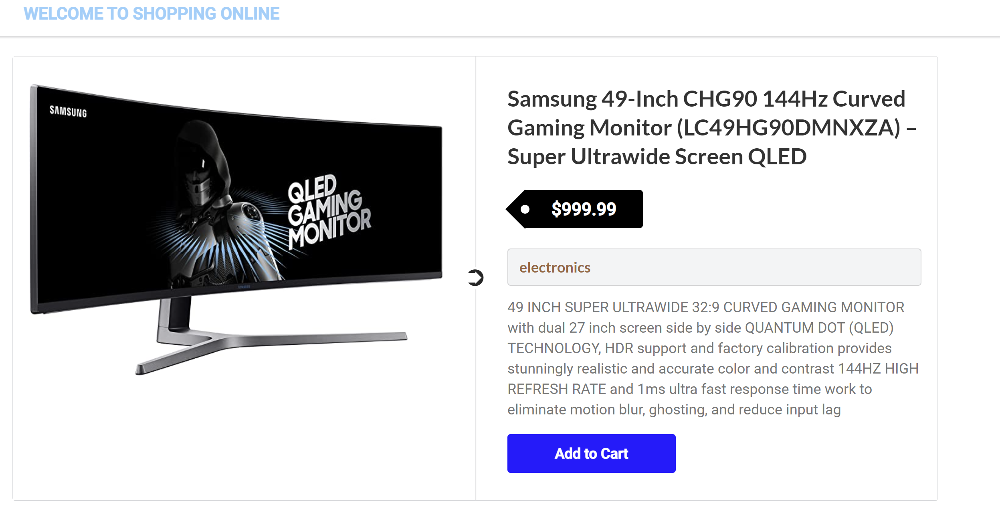

# shopping-website
***A simple example of an online product store where you can view products and check product details.***

## Instructions
##### 1. Clone ***( using `git clone` )*** or Download the folder ***( using ***`Download ZIP`*** option )*** #####
##### 2. Open your code editor and add the project folder #####
##### 3. Open the terminal and install all required dependencies with ***`npm i`*** #####
##### 4. type ***`npm start`*** to start the app #####

###### 🛒 *Enjoy using the app !* 🛒 ######
